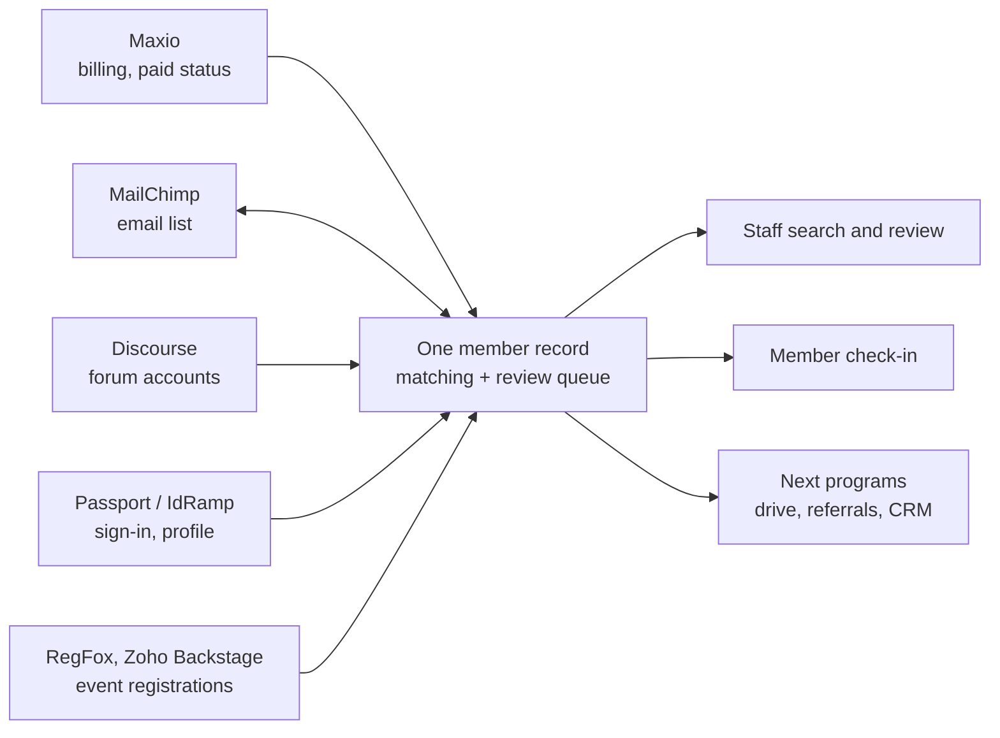

# Program 1: Member Source of Truth

> **Status:** Proposed (draft for board review, 5 October 2026)
> **Estimate:** 55 hours in total, before donated time
> **Budget cap:** dollar cap set with the engagement terms, before the board vote
> **Builds it:** the technology lead (terms in a separate engagement)

## The ask

Approve Program 1: one source-of-truth record for every COPA member, built from the systems COPA already runs, with tools to search, fix and use it. It is the first program under the [Technology Governance Policy](../governance-policy.md) and the foundation for the membership drive, the referral program and everything after them.

Much of the groundwork already exists in COPA.fyi, so a first usable version comes early in the program.

## The problem

COPA has no single answer to "who are our members?" Member data is spread across four systems that don't stay in sync:

| System | What it holds | The gap |
| --- | --- | --- |
| Maxio | Billing, subscriptions, mailing address | The only record of who has paid. Nothing else gets its updates. |
| MailChimp | Email list | Gets a contact when an account is created, then never again. Address and email changes don't reach it. |
| Passport / COPA website | Profile: CFI status, certificates, home airport, tail number | Not connected to Maxio. |
| Discourse | Forum account and profile | Members are matched by email only, if at all. |

Volunteers are checking members one at a time across these systems by hand. They have found paid members missing from one or more systems, and people with three or four records under different emails and addresses, some paying for two active memberships.

Every planned program depends on knowing who a member is, including the first-year-free drive, the referral leaderboard and the record cleanup campaign. None of them can be measured until this is fixed.

## What gets built

One member record per person, linked to that person's accounts in every COPA system, with the history of how each link was made.

**Already in place in COPA.fyi** (checked against the database on 2 October 2026):

- A Postgres member table of 1,087 people who have signed in, with 1,078 linked to their Maxio customer record, 684 to their Discourse account and 438 with a pilot profile.
- Membership status read from Maxio: 1,010 active and 77 inactive.
- Nightly event sync from RegFox (1,117 registrations since December 2022) and Zoho Backstage (7,372 since February 2021).
- An identity-matching table covering eight systems that records how each match was made, how confident it is, and who confirmed it. It is built and tested, but only on sample records so far.

**New in this program:**

1. **Everyone, not just sign-ins.** Import every Maxio customer, every Discourse user, the MailChimp audience and Passport profiles, so the record covers the whole membership and not only the roughly 1,100 people who have used COPA.fyi.
2. **Matching.** Link records automatically by email, then by name, tail number and pilot certificate (FAA records are public). Every match is logged with its method and confidence.
3. **Review queue.** Staff resolve the matches the system can't settle: duplicates, multiple paid memberships, conflicting addresses.
4. **Admin tools.** Search and filter every member, see one person's full picture across all systems on one screen, and export lists.
5. **Stay in sync.** Nightly updates from every source, with changes pushed back to MailChimp so its list stops drifting.
6. **Member check-in.** Members confirm or complete their own record (certificate, home airport, tail number, CFI) through a prompt at forum sign-in and a "check in with COPA" link, with a store discount as the incentive.

### Member record fields

First pass from the membership team (2 October 2026):

| Field | Notes |
| --- | --- |
| Name, email, phone | |
| Primary and secondary physical address | Seasonal homes |
| Individual or household membership | See open decisions |
| Home airport code | |
| Aircraft owned (Cirrus? model?) and tail number | |
| Pilot? Certificate number | Also used to stop repeat first-year-free signups |
| Non-pilot affiliation | Vendor (aircraft, insurance or finance broker), enthusiast, or companion |
| Gender | Offers COPA Women Pilots membership |
| Email preferences | Opt in or out of local events and marketing |
| Payment details | **Not stored.** Card data stays with the payment processor; the record keeps only the processor's customer and subscription IDs |

Still to discuss: a member directory opt-in, a short bio, interests (training, formation and so on), volunteering interest, Code of Conduct sign-off for the forums, and when to ask members to confirm their details.

## Out of scope

These come later, as their own programs, built on this record:

- Replacing Maxio. It stays as the card processor.
- Replacing Passport or IdRamp sign-in.
- The member-journey CRM and automated messaging.
- First-year-free validation, campaign tracking and the referral leaderboard.
- A member-facing portal beyond the check-in page.

## Milestones

1. **Phase 1: first usable version.** All four sources imported and matched automatically, using the Maxio and MailChimp reconciliation the membership team has already done as the starting point and the test set for matching. Admin search live. Staff stop checking systems by hand.
2. **Phase 2: cleanup.** Review queue and duplicates report live, including duplicate paid memberships. Corrected records sync back to MailChimp.
3. **Phase 3: members help.** Forum sign-in prompt and check-in link live, ahead of the Q1 2027 membership drive.

## Done when

- Every Maxio customer, Discourse user and MailChimp contact appears on exactly one member record or in the review queue.
- Staff can answer "is this person a paid member, and what do we know about them?" from one screen.
- Membership counts match Maxio exactly.
- The architecture, runbook and data export are documented, and a second person can run it, as the Governance Policy requires.

## Cost, ownership and maintenance

- **Build cost:** an estimated 55 hours in total, before donated time. Half of the technology lead's hours are donated; the rest are billed under the separate engagement terms. Not to exceed $___ without returning to the board.
- **Running cost:** runs on the database and hosting COPA.fyi already uses; no new vendor. Any change in monthly hosting cost is reported with each update.
- **Ownership:** code, data and accounts belong to COPA under the Governance Policy. Member data never leaves COPA-controlled systems and is never published here.
- **Maintenance:** sync and matching run automatically. Problems and fixes are logged, and routine changes go through the same logged, reversible process as all COPA software.
- **Reporting:** hours (billed and donated), progress against the milestones, and record counts, in the Updates section below and to the board monthly.

## Open decisions

- **Duplicate paid memberships:** refund, merge, or leave as a gift membership? A policy call for the board or the Director of Operations.
- **Individual and household membership:** the record supports both. The proposed household membership is $125 a year against $95 individual. Today's sign-in system grants a login only to someone with their own Maxio customer record, so the workable setup is a separate $30 household-member subscription on the second person's own record, not an add-on to the primary member's. The record keeps one record per person, links them with a household ID, and flags any household member whose primary has lapsed. The household proposal itself goes to the board separately.
- **Europe:** include European members in this program, or run them as a follow-on?
- **Access:** who can see and edit member records (staff, goal leaders, regional volunteers)?

## Updates

None yet.
