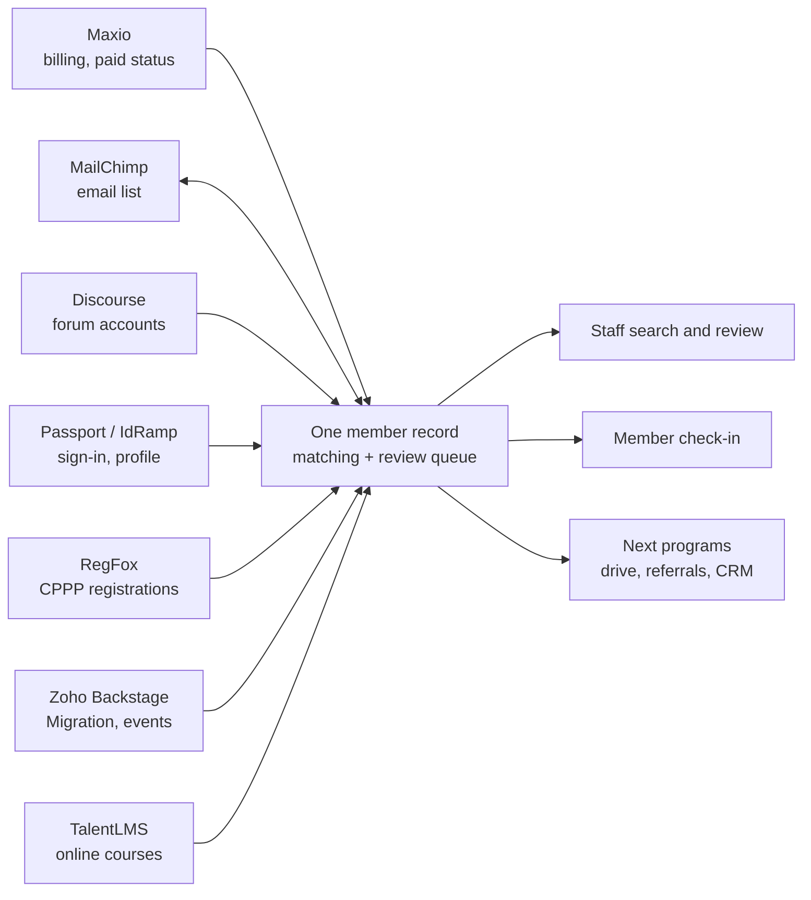

# Program 1: Member Source of Truth

> **Status:** Proposed (draft for board review, 5 October 2026)
> **Estimate:** 85 hours in total, before donated time
> **Budget cap:** dollar cap set with the engagement terms, before the board vote
> **Builds it:** the technology lead (terms in a separate engagement)

## The ask

Approve Program 1: one source-of-truth record for every person COPA deals with, across all of One COPA, built from the systems COPA already runs, with tools to search, fix and use it. It is the first program under the [Technology Governance Policy](../governance-policy.md) and the foundation for the membership drive, the referral program and everything after them.

Much of the groundwork already exists in COPA.fyi, so a first usable version comes early in the program.

## The problem

COPA has no single answer to "who are our members?" This is a One COPA problem, not just a membership one: the same person can join the association, post in the forums, take CPPP or an online course, and register for Migration, and each of those lives in a different system. None of them stay in sync:

| System | What it holds | The gap |
| --- | --- | --- |
| Maxio | Billing, subscriptions, mailing address | The only record of who has paid. Nothing else gets its updates. |
| MailChimp | Email list | Gets a contact when an account is created, then never again. Address and email changes don't reach it. |
| Passport / COPA website | Profile: CFI status, certificates, home airport, tail number | Not connected to Maxio. |
| Discourse | Forum account and profile | Members are matched by email only, if at all. |
| RegFox | CPPP registrations | Registrations sit apart from the member record. |
| Zoho Backstage | Migration and other event registrations | Same. |
| TalentLMS | Online courses | Course accounts sit apart from the member record. |

Maxio also marks non-paying guest accounts as "active", so its active count is not a count of paying members.

In early October the membership team checked 100 members by hand across Maxio and MailChimp. They found guests and paying members both shown as active; canceled members still getting member emails; members who renewed still shown as canceled in MailChimp; people tagged as members in MailChimp with no Maxio record; one person under several email addresses; bounced addresses removed from lists instead of fixed; and forum access for people who no longer pay. Unsubscribing is all or nothing, so a member who only wants Women Pilots email loses everything.

Volunteers are checking members one at a time across these systems by hand. They have found paid members missing from one or more systems, and people with three or four records under different emails and addresses, some paying for two active memberships.

Every planned program depends on knowing who a member is, including the first-year-free drive, the referral leaderboard and the record cleanup campaign. None of them can be measured until this is fixed.

## What gets built

One member record per person, linked to that person's accounts in every COPA system, with the history of how each link was made.

**Already in place in COPA.fyi** (checked against the database on 2 October 2026):

- A Postgres member table of 1,087 people who have signed in, with 1,078 linked to their Maxio customer record, 684 to their Discourse account and 438 with a pilot profile.
- Membership status read from Maxio: 1,010 active and 77 inactive. Guest accounts already count as not active here: a person counts as a member only with an active or trialing subscription to a paid product, never the COPA Guest Membership.
- Nightly event sync from RegFox (1,117 registrations since December 2022) and Zoho Backstage (7,372 since February 2021).
- An identity-matching table covering eight systems that records how each match was made, how confident it is, and who confirmed it. It is built and tested, but only on sample records so far.

**New in this program:**

1. **Everyone, not just sign-ins.** Import every Maxio customer, every Discourse user, the MailChimp audience, Passport profiles, and everyone in RegFox, Zoho Backstage and TalentLMS, so the record covers the whole membership and not only the roughly 1,100 people who have used COPA.fyi.
2. **Matching.** Link records automatically by email, then by name with mailing address, then against the FAA's public files: the aircraft registry (tail number to registered owner and address) and the airmen file (name and address to certificate, ratings and medical). A person with several email addresses gets one record that holds them all. Every match is logged with its method and confidence. The airmen file also shows who holds a pilot or flight instructor certificate, so the record can tell pilots from companions and confirm CFI status, which neither Maxio nor MailChimp can. The public airmen file has no certificate numbers, and airmen can withhold their address from it, so a certificate number a member gives us is stored but can't be checked against it.
3. **Review queue.** The membership team resolves what the system can't settle: duplicates, conflicting addresses, people MailChimp tags as members who have no Maxio record, and bounced email addresses (so the address gets fixed rather than the person deleted). Anything involving money, such as duplicate paid memberships, goes to the Director of Operations.
4. **Admin tools.** Search and filter every member, see one person's full picture across all systems on one screen, add staff notes, and export lists. Built-in lists replace hand-kept spreadsheets: for example, Women Pilots members, past-due members for personal follow-up, paid, guest and canceled counts by system, and forum accounts that have member access without a paid membership.
5. **Paid, guest and lapsed kept apart.** In Maxio, guest subscriptions always show as active because they never renew, while paid ones are active, past due or canceled. The record shows paying, past due, guest and canceled as separate statuses, with the date and reason of every change (for example, canceled after failed-card notices), so counts never mix them.
6. **Stay in sync.** Nightly updates from every source. Every Maxio change (renewal, card update, past due, cancellation) reaches MailChimp by the next day, not just new sign-ups, so canceled members stop getting member emails and renewed members stop showing as canceled. Unsubscribes, unsubscribe reasons and bounces come back from MailChimp into the record.
7. **Email by topic.** Members choose which COPA email they get (for example COPA news, Women Pilots, formation, CPPP, events) instead of all or nothing. This is set up as MailChimp groups, and each member's choices are kept on the record.
8. **Member check-in.** Members confirm or complete their own record (certificate, home airport, tail number, CFI) through a prompt at forum sign-in and a "check in with COPA" link, with a store discount as the incentive.

### Member record fields

First pass from the membership team (2 October 2026). Before Phase 1 ends, the membership team circulates the list to each part of One COPA (goal leaders, CPPP and training, events), each field is marked required or optional, and the Director of Operations signs off the final list.

| Field | Notes |
| --- | --- |
| Name, email, phone | |
| Primary and secondary physical address | Seasonal homes |
| Individual or household membership | See open decisions |
| Home airport code | |
| Aircraft owned (Cirrus? model?) and tail number | |
| Pilot? Certificate number | Also used to stop repeat first-year-free signups |
| Non-pilot affiliation | Vendor (aircraft, insurance or finance broker), enthusiast, or companion |
| Gender | Offers COPA Women Pilots membership |
| Email preferences | By topic (COPA news, Women Pilots, formation, CPPP, events, local events), not all or nothing |
| Member directory listing | The member's choice is stored either way; opt-in or opt-out is an open decision |
| Payment details | **Not stored.** Card data stays with the payment processor; the record keeps only the processor's customer and subscription IDs |

Still to discuss: a short bio, interests (training, formation and so on), volunteering interest, Code of Conduct sign-off for the forums, and when to ask members to confirm their details.

## Out of scope

These come later, as their own programs, built on this record:

- Replacing Maxio. It stays as the card processor.
- Replacing Passport or IdRamp sign-in.
- The member-journey CRM and automated messaging.
- First-year-free validation, campaign tracking and the referral leaderboard.
- A member-facing portal beyond the check-in page.
- New membership types (household, student, instructor). Each is a board decision; the record supports them once approved, and FAA data can confirm instructor status.
- Guessing gender or pilot status from names. Gender comes from members themselves; pilot status comes from the FAA match.
- Maxio's own failed-card emails. Whether they reach members' inboxes is checked separately with Maxio.

## Milestones

1. **Phase 1: first usable version.** Field list agreed. Maxio, MailChimp, Discourse, Passport, RegFox and Zoho Backstage imported and matched automatically, using the Maxio and MailChimp reconciliation the membership team has already done as the starting point and the test set for matching. Admin search live. Staff stop checking systems by hand.
2. **Phase 2: cleanup.** TalentLMS added. Review queue and duplicates report live, including duplicate paid memberships and guest accounts. Maxio changes reach MailChimp daily; email-by-topic and the forum access list live. Corrected records sync back to MailChimp.
3. **Phase 3: members help.** Forum sign-in prompt and check-in link live, ahead of the Q1 2027 membership drive.

## Done when

- Every person in each connected system appears on exactly one member record or in the review queue.
- Staff can answer "is this person a paid member, and what do we know about them?" from one screen.
- Paid membership counts match Maxio's paid subscriptions exactly, with guests counted separately.
- A change in Maxio shows up in MailChimp by the next day.
- Every forum account with member access belongs to a paying member, or is on a list for the membership team to resolve.
- The architecture, runbook and data export are documented, and a second person can run it, as the Governance Policy requires.

## Cost, ownership and maintenance

- **Build cost:** an estimated 85 hours in total, before donated time. Half of the technology lead's hours are donated; the rest are billed under the separate engagement terms. Not to exceed $___ without returning to the board.
- **Running cost:** runs on the database and hosting COPA.fyi already uses; no new vendor. Any change in monthly hosting cost is reported with each update.
- **Ownership:** code, data and accounts belong to COPA under the Governance Policy. Member data never leaves COPA-controlled systems and is never published here.
- **Maintenance:** sync and matching run automatically. Problems and fixes are logged, and routine changes go through the same logged, reversible process as all COPA software.
- **Reporting:** hours (billed and donated), progress against the milestones, and record counts, in the Updates section below and to the board monthly.

## Open decisions

- **Duplicate paid memberships:** refund, merge, or leave as a gift membership? A policy call for the board or the Director of Operations.
- **Individual and household membership:** the record supports both. The proposed household membership is $125 a year against $95 individual. Today's sign-in system grants a login only to someone with their own Maxio customer record, so the workable setup is a separate $30 household-member subscription on the second person's own record, not an add-on to the primary member's. The record keeps one record per person, links them with a household ID, and flags any household member whose primary has lapsed. The household proposal itself goes to the board separately.
- **Guest accounts:** does COPA still need the Maxio Guest product? If so, what is it for? Either way the record keeps guests apart from paying members.
- **Member directory:** opt-in or opt-out? A members-only directory is a small follow-on once this record exists. Opt-out would list members who never said yes, so it needs a board decision and notice to members first.
- **Europe:** include European members in this program, or run them as a follow-on?
- **Failed-card follow-up:** Maxio sends automated notices for six months with no personal contact. Should the membership team reach out, and when? The record gives them the list.
- **Access:** who can see and edit member records (staff, goal leaders, regional volunteers)? The membership team has asked for Maxio access; the admin screen shows each person's Maxio status, which may be enough.

## Updates

None yet.
